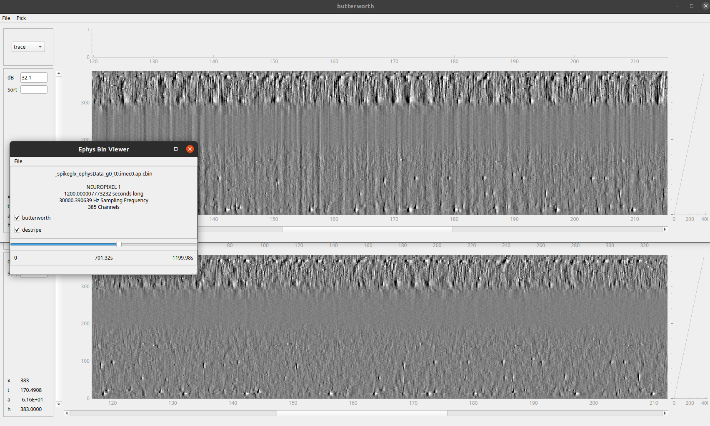
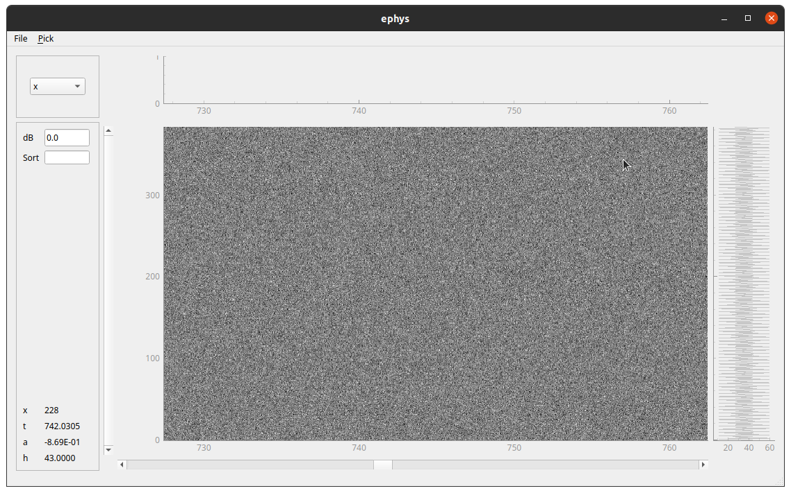

# viewephys
Neuropixel raw data viewer

## Installation
`pip install viewephys`

Alternatively, in development mode:
```shell
git clone https://github.com/int-brain-lab/viewephys.git
cd viewephys
pip install -e .
```

### Supported environments
This is compatible with the [IBL environment](https://github.com/int-brain-lab/iblenv)

Otherwise, you can create a new environment as such:
```shell
conda create -n viewephys python=3.12
conda activate viewephys
```
And then follow the install instructions above.

## Controls
- `ctrl + z`: -3dB gain
- `ctrl + a`: +3dB gain
- `ctrl + p`: in multi-windows mode, link the displays (pan, zoom and gain)

### Pick spikes
When the picking mode is enabled (menu pick)
- left button click sets a point
- shift + left button removes a point
- control + left does not wrap on maximum around pick
- space increments the spike group number


## Examples

### Visualize raw binary file
Activate your environment and type `viewephys`, you can then load a neuropixel binary file using the file menu.



Alternatively you can point the viewer to a specific file using the command line:
```shell
viewphys -f /path/to/raw.bin
```

### Load in a numpy array or slice
```python
# if running ipython, you may have to use the `%gui qt` magic command
import numpy as np
from viewephys.gui import viewephys
nc, ns, fs = (384, 50000, 30000)  # this mimics one second of neuropixel data
data = np.random.randn(nc, ns) / 1e6  # volts by default
ve = viewephys(data, fs=fs)
```

    

## Contribution
Fork and PR.

Pypi Release checklist:
```shell
flake8
rm -fR dist
rm -fR build
python setup.py sdist bdist_wheel
twine upload dist/*
#twine upload --repository-url https://test.pypi.org/legacy/ dist/*
```
