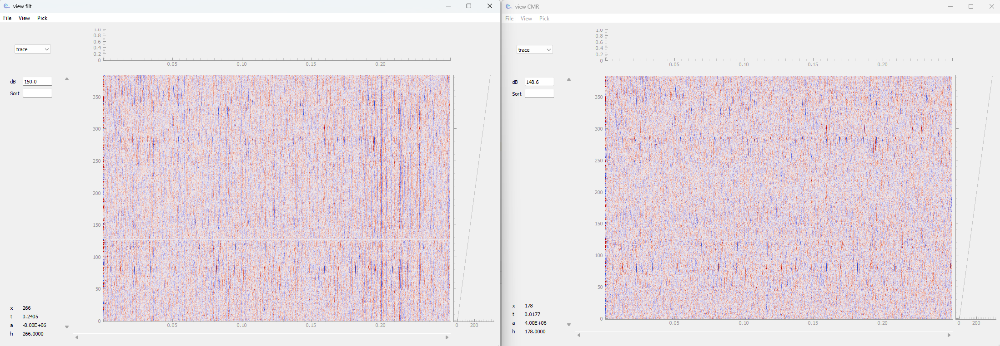

# Examples

This contains a  number of examples for working with `viewewphys`. Note all examples are run 
in a script, and so we create an `app` at the start of the script and run `app.exec()` at the end,
to manage the `Qt` event loop.

To run these examples in the Python console or iPython, you should remove these calls.

`from_binary.py` : How to load a binary file into `viewephys`

`from_array.py` : Look at the data before and after different preprocessing steps in spikeinterface:

