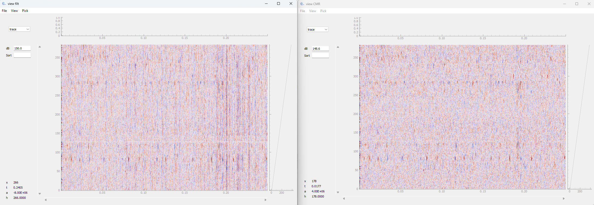

# Examples

This contains a  number of examples for working with `viewewphys`.

`from_binary.py` : How to load a binary file into `viewephys`

`from_array.py` : Look at the data before and after different preprocessing steps in spikeinterface:

`from_spikeinterface_stim.py` : Load a SpikeGLX recording through SpikeInterface, build a simple cleaned layer, and open the stim artefact viewer using `example_stim_events.csv`.
